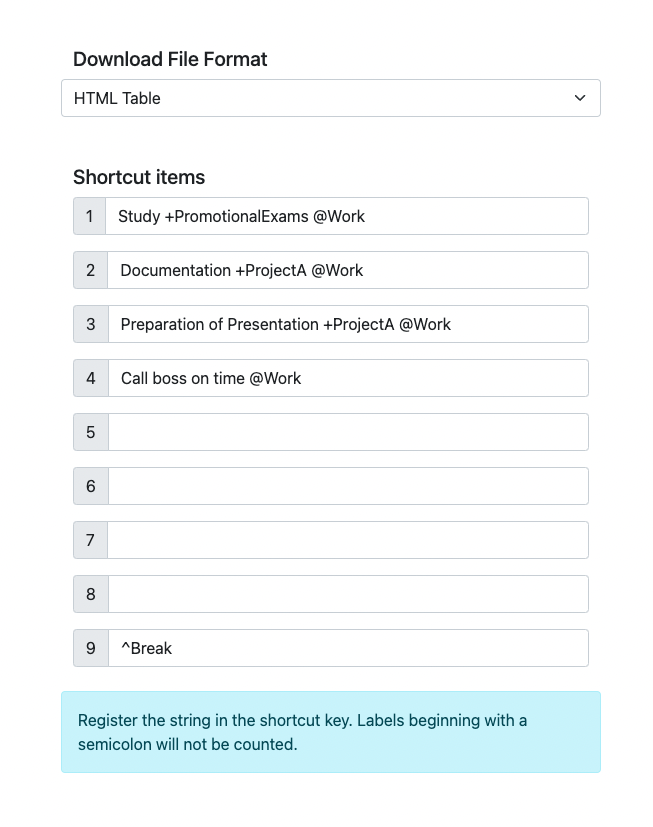
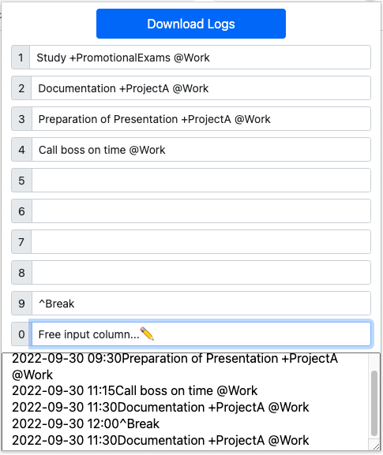
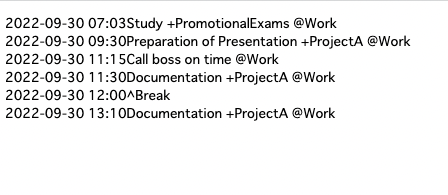
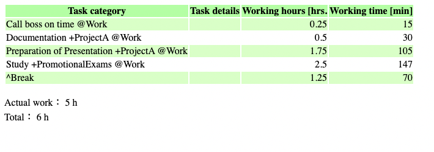
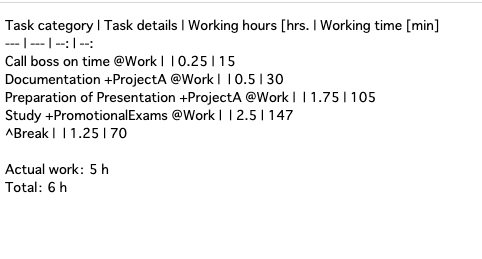

# How to Install

1. Download the Zip file.
2. Extract the downloaded Zip file.
3. Open a Chrome compatible browser (e.g. Chrome, Edge, Brave, Chromium) and go to the Extensions page in Settings. <chrome://extensions/>
4. Enable "Developer Mode".
5. Click "Extract and Load" and select the folder "chrome_extension_sample" for the extracted extension from the dialog.

Or install from chrome web store.(Coming soon...)

## Usage

### 1. Setup

Option settings are saved automatically.

1. Open the Extension Options screen.
2. Select the log download file format.
3. Fill in the tasks corresponding to the numeric keypad shortcut keys from 1 to 9 keys. Tasks can be changed after stamping.
4. If you prefix a task name with "^", it will be excluded from the actual working hours during that task. Please use this function for measuring break time, etc.

figure 1: Option screen

### 2. Stamp

1. Press "Alt+Shift+0" while the browser is running or click on the extension icon to open the imprinting popup.
2. When keys 1 to 9 are entered while the pop-up has focus, the preset task set in the options screen will be registered in the area at the bottom of the pop-up along with the current time.
3. Pressing the 0 key shifts the focus to the free input field. Enter the content of the task; press Enter to clear the pop-up and complete the registration.
4. No matter which key you use to register a task, the date and time will be automatically appended. The text at the bottom of the popup can be freely edited, so you can modify it after registration.
5. Pop-up windows can also be closed by pressing the escape key or "Alt+Shift+0" key.

figure 2: Pop-up screen

### 3. Download logs

1. Click the "Download Logs" button at the top of the popup to download the log in the file format that was selected on the options screen.
   2.Press "Alt+Shift+D" to download without opening the pop-up window.

figure 3: Log downloaded in plain text

figure 4: Log downloaded in HTML table

figure 5: Log downloaded in Markdown table

## Known Defects

-   [ ] Logs can only be up to the most recent 100 logs. Older logs before that are erased.
-   [ ] If you enter the information from the free description field (number 0), it may not be displayed in the log preview section at the bottom of the popup, even though it is registered.
-   [ ] If you edit directly in the log preview field at the bottom of the pop-up, the formatting may be corrupted and the data may not tally correctly, but there is no way to recover other than by manual intervention.
-   [ ] It is not possible to close the aggregation period at any given time. You can work around this by copying the entire log from the preview column, trimming it with an editor, etc., and then putting it back in the preview column.

## License

MIT
